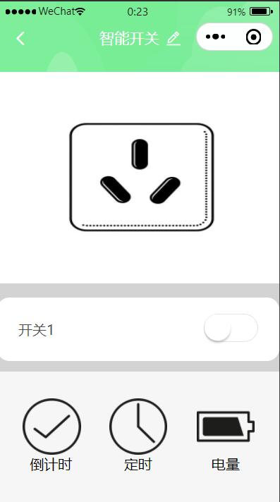

This project is developed using Tuya SDK, which enables you to quickly develop branded apps connecting and controlling smart scenarios of many devices.For more information, please check Tuya Developer Website.
本次智能插座开发小程序预计完成电量统计，电量分析，开关控制，定时开关

